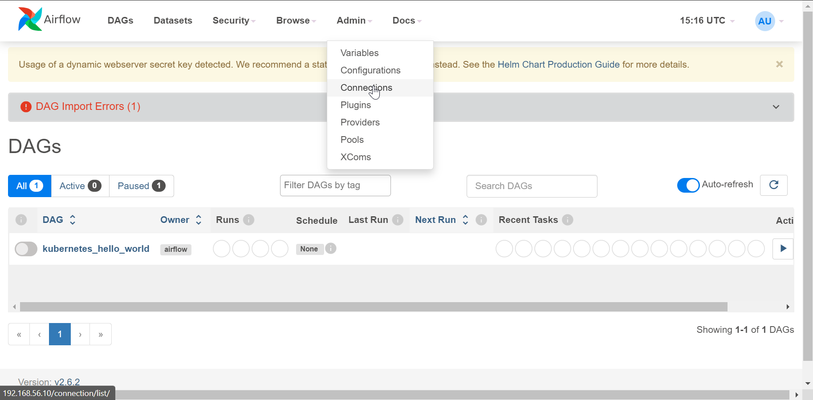
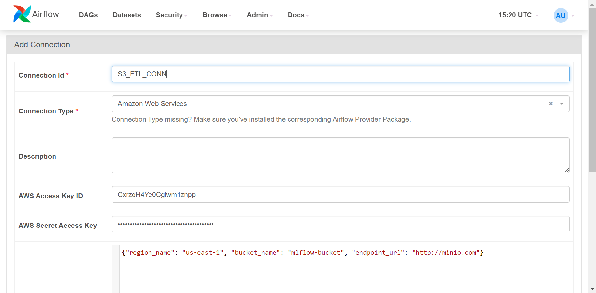

# MLOps
Развертки ML-стэнда для CI. Стэк:
- k3s
- Airflow
- Mlflow
- Minio
- Postgresql
## Развертка стэнда
```bash
ansible-playbook main.yml
```
Доступ к UI AIRFLOW: https://192.168.56.10/
## Настройка
- ### Настройка соединения с minio s3.
Для простоты воспользуемся UI AIRFLOW:


- ### ~~Дописать~~
## Мониторинг
## Тестирование
